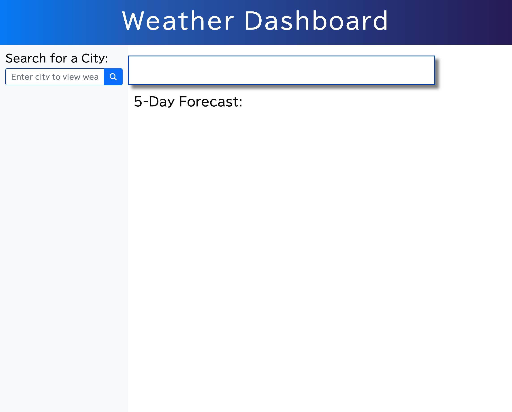
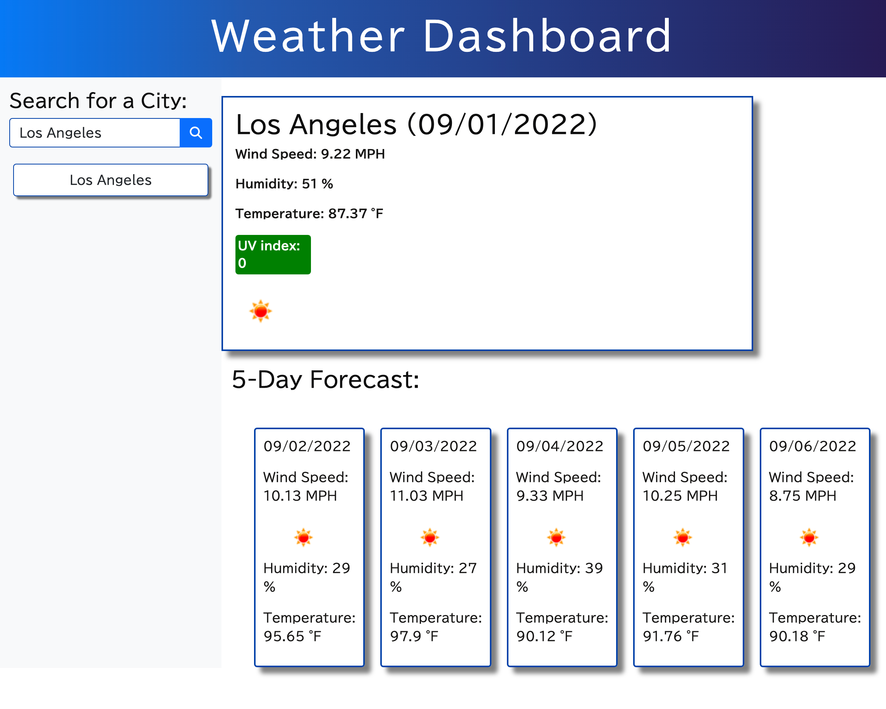
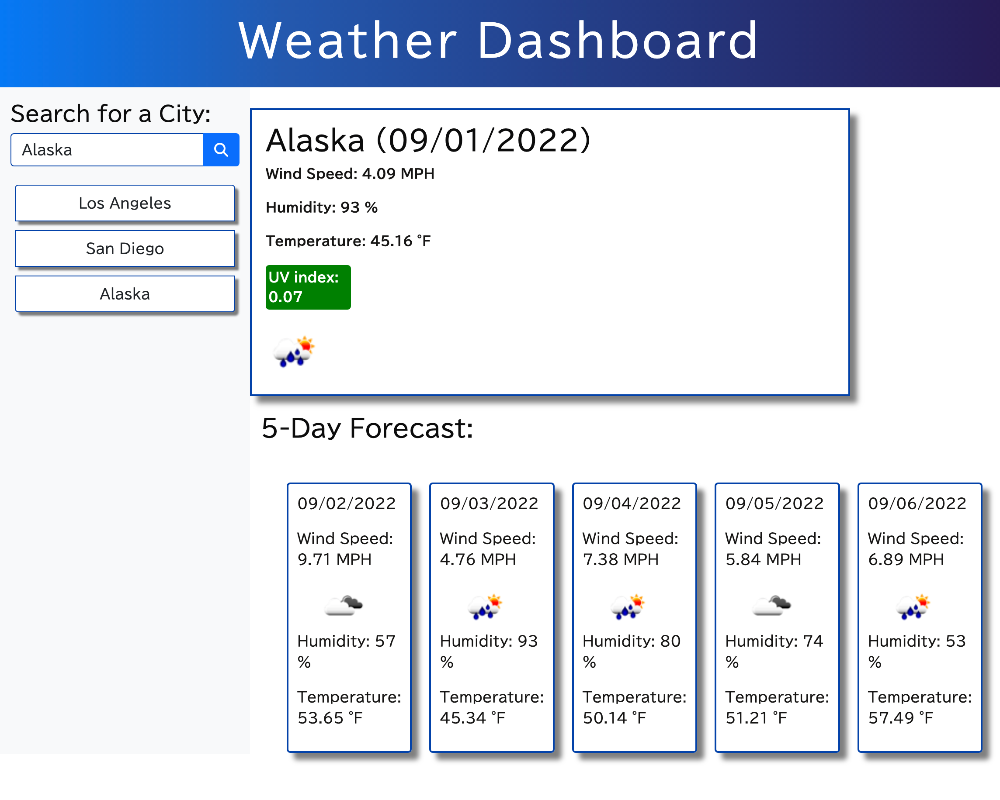

# Weather Dashboard


Weather Dashboard that runs in the browser and feature dynamically updated HTML and CSS. This app will retrieve data through Third-party APIs and functionality by making requests with specific parameters to a URL.  

## User Story

```
AS A traveler
I WANT to see the weather outlook for multiple cities
SO THAT I can plan a trip accordingly
```


### Screenshots

<br>
<br>
<br>

### Links

[The URL of the functional, deployed application.](https://noori36.github.io/CodeQuiz/)

[The URL of the GitHub repository.](https://github.com/noori36/Weather-Dashboard)

## Tech

- OpenWeather One Call AP
- Moment.JS
- Bootstrap
- HTML
- CSS
- JavaScript

## License

[MIT](https://choosealicense.com/licenses/mit/)


