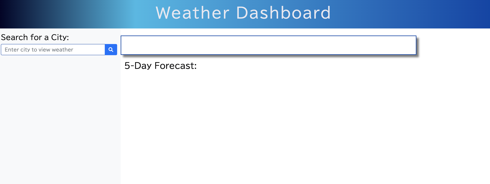
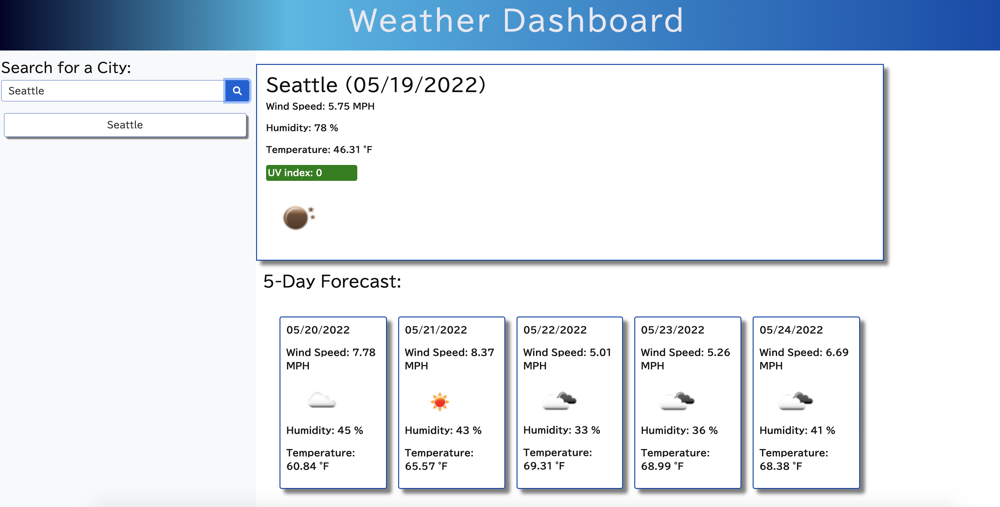
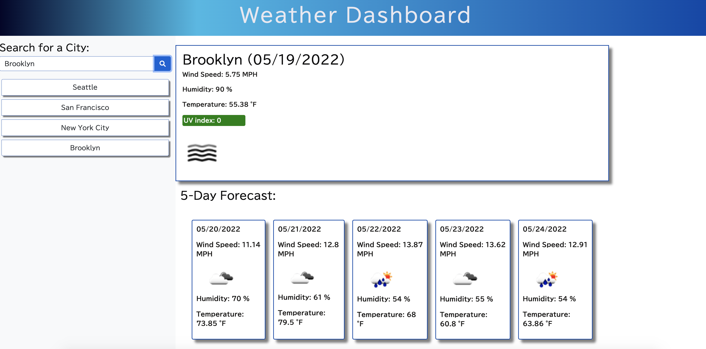

# Weather Dashboard

## Title

Weather Dashboard

## User Story

```
AS A traveler
I WANT to see the weather outlook for multiple cities
SO THAT I can plan a trip accordingly
```

## Acceptance Criteria

```
GIVEN a weather dashboard with form inputs
WHEN a user searches for a city
THEN they are am presented with current and future conditions for that city and that city is added to the search history.
WHEN a user views current weather conditions for that city
THEN they are am presented with the city name, the date, an icon representation of weather conditions, the temperature, the humidity, the wind speed, and the UV index.
WHEN a user views the UV index
THEN they are presented with a color that indicates whether the conditions are favorable, moderate, or severe.
WHEN a user views future weather conditions for that city
THEN they are presented with a 5-day forecast that displays the date, an icon representation of weather conditions, the temperature, the wind speed, and the humidity.
WHEN a user clicks on a city in the search history
THEN they are again presented with current and future conditions for that city.
```

## Technology Used
<ul>
<li><a href="https://openweathermap.org/api/one-call-api"> OpenWeather One Call AP</a></li>
<li><a href="https://momentjs.com/">Moment.JS</a></li>
<li><a href="https://fontawesome.com/">Font Awesome</a></li>
<li><a href="https://getbootstrap.com/docs/5.1/getting-started/introduction/">Bootstrap</a></li>
<li><a href="https://fonts.google.com/">Google Fonts</a></li>

</ul>


### Screenshots

<br>
<br>
<br>

### Links

<br>Link to view <a href="https://lemming97.github.io/Weather_Dashboard/">Weather Dashboard</a>

